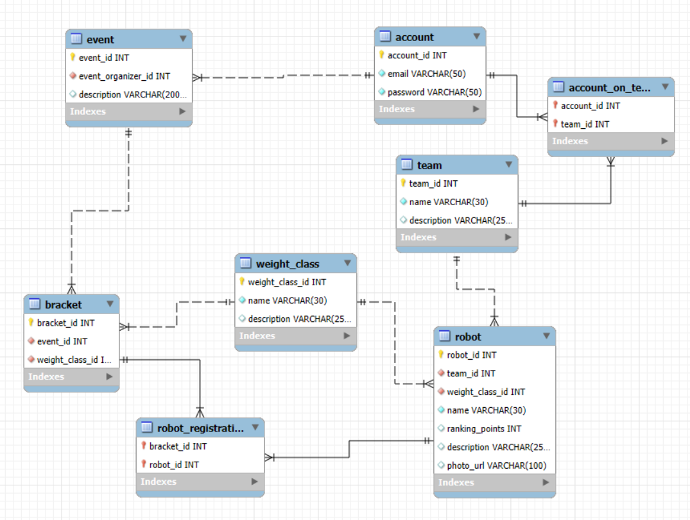

# Combat Robotics

## Successful Queries:
Question: "What are the best performing robots in each weight class? What kind of bots are they?"

Answer: "The best-performing robots in each weight class and their types are as follows:

- Fairyweight 150g: Phalanx, a 2WD fork wedge bot with 21 ranking points.
- Plastic Antweight 1lb: WedgeMe, a durable wedge with 25 ranking points.
- Beetleweight 3lb: War Drum, a double weapon bot with 35 ranking points.
- Beetleweight 3lb: Orbit, a 4WD Beater Bar with a self-righting arm and a 4140 hardened steel spinner, also with 35 ranking points."

## Unsuccessful Query:
When the query results were zero, instead of answering "there were no robots" or "no teams matched that description", ChatGPT seemed to be confused. Even when I explicitly told it in the instruction line "If the query result is blank, it is not by mistake. That was the query result", it still was confused as to what to do. Perhaps this was due to using a zero shot approach.

Question: "Which teams have less than three robots?"

Answer: "The query result is blank."
